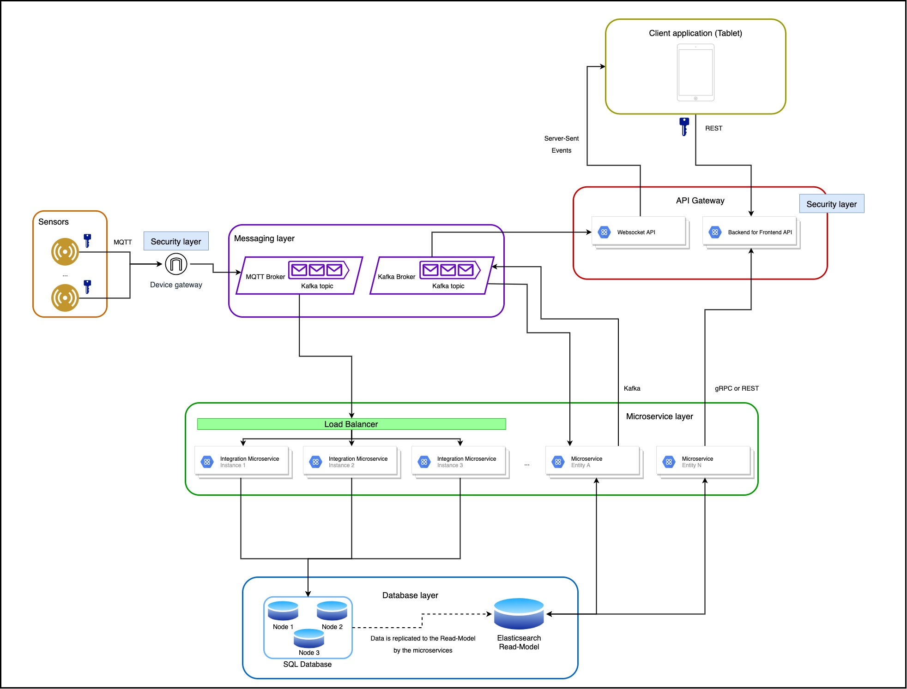

# Web Senior Challenge - SWORD Health

## Architecture diagram

## Architecture details

### Client - API communication

- Client communicates with its “own” API using a backend for frontend approach
- The requests are authenticated using a json web token, stored on a session http only cookie
- A possible improvement is the implementation of CSRF Protection (to prevent cross-site request forgery attacks)

### API Gateway layer

- The BFF (Backend for Frontend) API main goal would be to provide the required data for the client application to work and display everything it needs, consuming from multiple microservices (using REST or gRPC)
- We also could have an API responsible for pushing unidirectional events into the client using Server-Sent Events, for example, we wanted to notify the user about new data

### Messaging layer

- We could have 2 message brokers, one using MQTT for the sensors and other with Kafka for event communication
- The usage of MQTT communication is the standard messaging protocol for IoT systems being lightweight considering the low-performance of the devices, flexible to support several devices and asynchronous considering an unstable network latency
- Kafka on the other hand would be more focused to stream data between applications

### Microservices layer

- Several microservices could be available to provide authentication, relevant data or process data to our databases
- Some microservices that return data would be connected to an elasticsearch read-model that contain processed data, with better search performance and more oriented to the frontend needs or even aggregated data like per hour or per day
- Other microservices could work as message consumers to process integrations data, coming from sensors, writing that information to the database

### Database layer

- The database would be an SQL (MySQL for example), using a 3 node cluster in an active-active approach
- MySQL would guarantee uptime and data consistency
- Active-active, with 3+ nodes, would guarantee high availability in case of problems with one of the nodes going down or having network issues
- The sync between the database and the read-model would be guaranteed by the application writing to the database. Different approaches would be for the writing application to create messages to a queue or even to use a CDC (Change Data Capture) to read the database binlog and create messages with the changes

### Sensors

- Usage of token base authorisation (or other device security certificates) to allow communication between the devices and the message broker 

### Cost analysis

- The amount of instances of each service will increase the costs of the infrastructure	
- To improve costs we should generate metrics reports to analyse the usage of each application and identify the required memory/capacity to guarantee enough availability and minimize the overall costs

### Event driven

- The usage of a partial/full event driven architecture has advantages like leveraging asynchronous triggers, reducing the whole application dependencies and reduce the http overhead in some communications
- In a system like this one, there are several places where an event driven architecture makes sense: the sensors communication, push messages to the client or even communication between the client and the database or between microservices
- The usage of message queues has the benefit of allowing to recover “lost messages” easily in a scenario of sudden loss of availability

### High availability

- Since the data volume that the sensors produce is high, we should have at least 3 consumer instances to guarantee high availability and the possibility to split the load, even if one instance is down for some time, with the use of a load balancer

