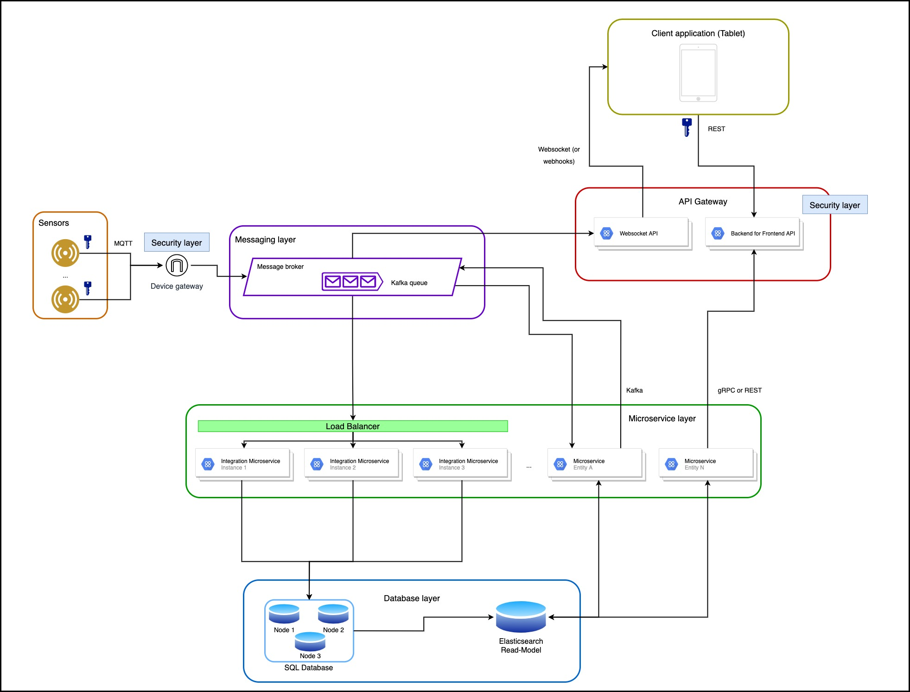

# Web Senior Challenge - SWORD Health

## Architecture diagram

## Architecture details

### Client - API communication

- Client communicates with its “own” API using a backend for frontend approach
- The requests are authenticated using a json web token, stored on a session http only cookie
- A possible improvement is the implementation of CSRF Protection (to prevent cross-site request forgery attacks)
- In addition to the REST communication, we could also push data to the client application using a websocket if, for example, we wanted to notify the user about new data

### BFF (Backend for Frontend) API

- The main goal would be to provide the required data for the client application to work, consuming from multiple microservices (using REST or gRPC)

### Microservices

- Several microservices could be available to provide authentication, data or process data
- Some microservices that return data would be connected to an elasticsearch read-model that would give processed data, with better search performance
- Other microservices could work as message consumers to process integrations data, coming from sensors, writing that information to the database

### Database

- The database would be an SQL (MySQL for example), using a 3 node cluster in an active-active approach
- MySQL would guarantee uptime and data consistency
- Active-active, with 3+ nodes, would guarantee high availability in case of problems with one of the nodes goes down or has network issues

### Sensors

- MQTT communication is the standard messaging protocol for IoT systems being lightweight, reliable and scalable
- Usage of token base authorisation (or other device security certificates) to allow communication between the devices and the message broker 

### Cost analysis

- The amount of instances of each service will increase the costs of the infrastructure	
- To improve costs we should generate metrics reports to analyse the usage of each application and identify the required memory/capacity to guarantee enough availability and minimize the overall costs

### Event driven

- The usage of a partial/full event driven architecture has advantages like leveraging asynchronous triggers, reducing the whole application dependencies and reduce the http overhead in some communications
- The usage of message queues also allows to recover “lost messages” easily in a scenario of sudden loss of availability

### High availability

- Since the data volume that the sensors produce is high, we should have at least 3 consumer instances to guarantee high availability and the possibility to split the load, even if one instance is down for some time

